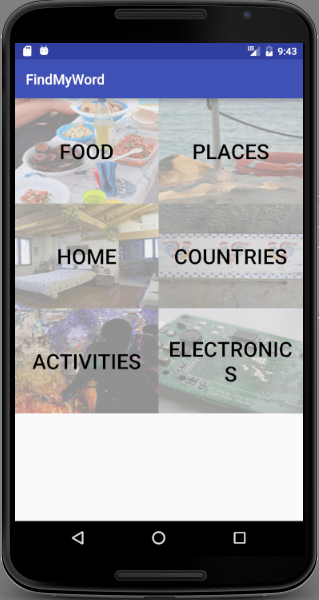

This application was created during the 30 hour DementiaHack 2017 Hackathon, targetting Challenge Set 1: aiding individuals diagnosed with dementia. The Flickr API Key is temporary and may cause problems when running the installed APK or attempting to reexport this code. 

<B>Headline:</B> FindMyWord is an app to assist patients with early stages of dementia to quickly find lost words without breaking the flow of conversation.

<B>Brief Idea:</B>
FindMyWord is an app to aid individuals with early stage dementia with a common and frustrating symptom, losing specific words. Patients who experience this are still able to describe their missing word in detail, so we aim to give them the tools to be able to quickly find and recall it to keep the flow of conversation going. FindMyWord uses simple categories, with large images, and emboldened text to allow users to quickly locate and recall the word they had intended to say. Relevant images are pulled from the internet to aid in quick recognition, as the main function of the app is speed. 

<B>Build:</B>
<li><B>Platform:</B> Android Phones & Tablets
<li><B>Languages:</B> Java, XML
<li><B>APIs:</B>  Google CSE, Flickr API, Datamuse
<li><B>Frameworks:</B> Retrofit, OkHttp, Picasso, GsonConverter
<li><B>Tools:</B> Android Studio IDE

<B>Team:</B>
<li>Filip Hasson - Filip_H - Frontend/User Interface
<li>Karol Zdebel - "Karol_Z" - Backend/Data Management
<li>Marc Santos - "Marc_S" - Third Party API Integration

<B>Link:</B>
<li><B>Repository:</B> https://github.com/FilipHasson/DementiaHack
<li><B>APK"</B> https://drive.google.com/open?id=0B88xrhIGF_wiRW1QUGZJVldSMjQ
To install the app download the APK to an Android device. Tap to run the APK and select install.

<B>Demo Screenshots:</B>

